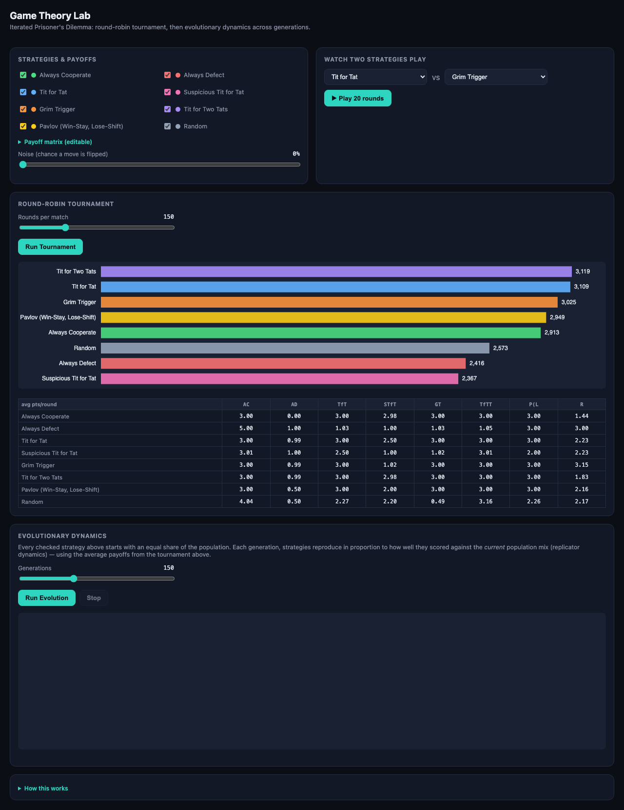
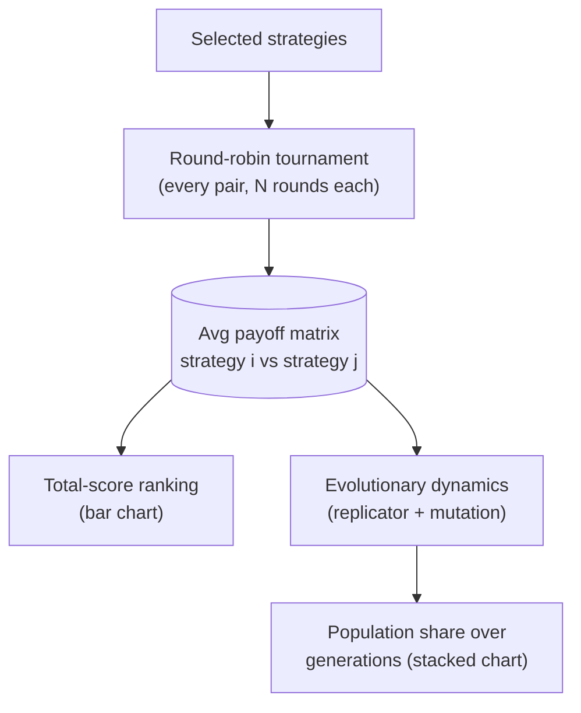
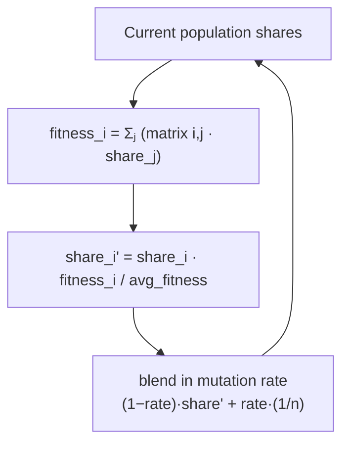
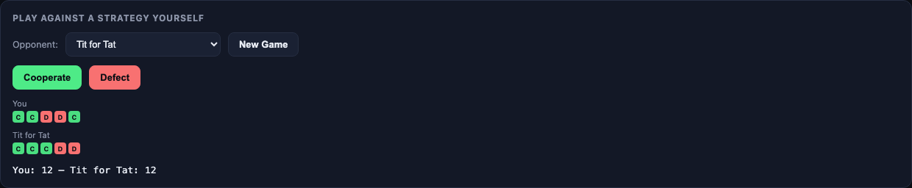
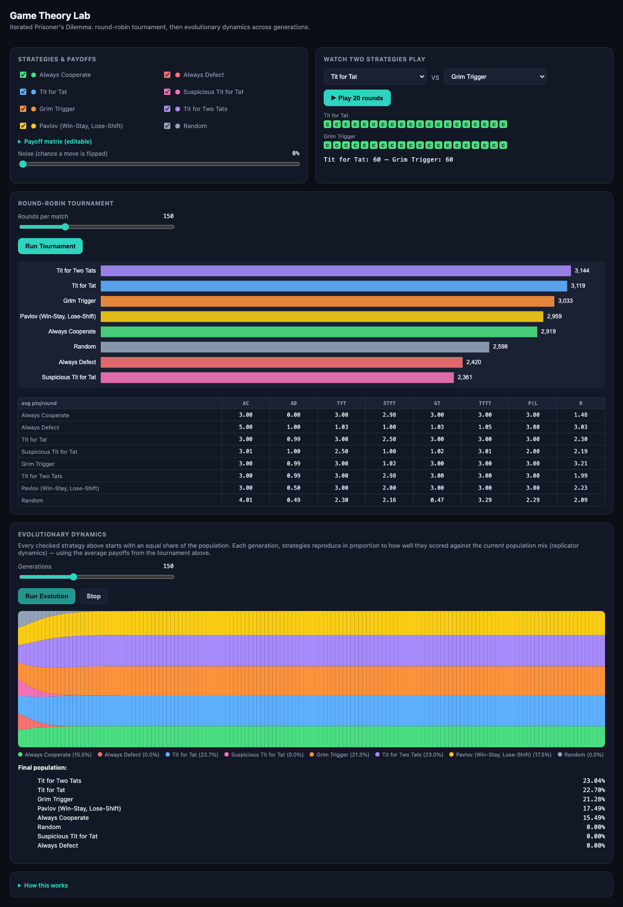
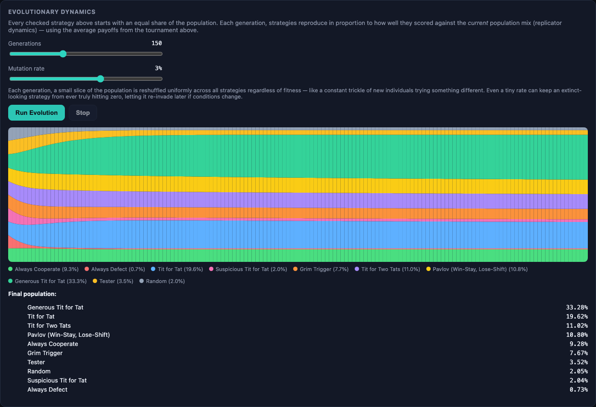
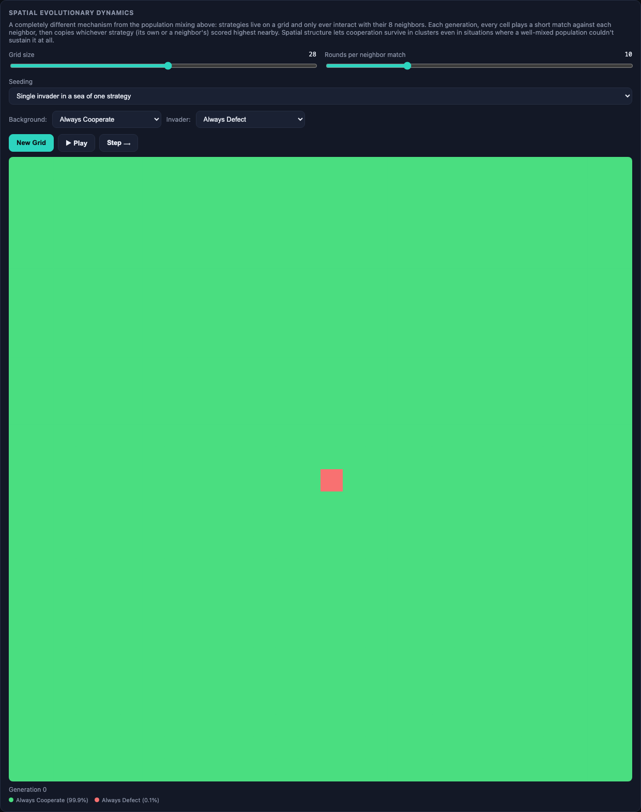
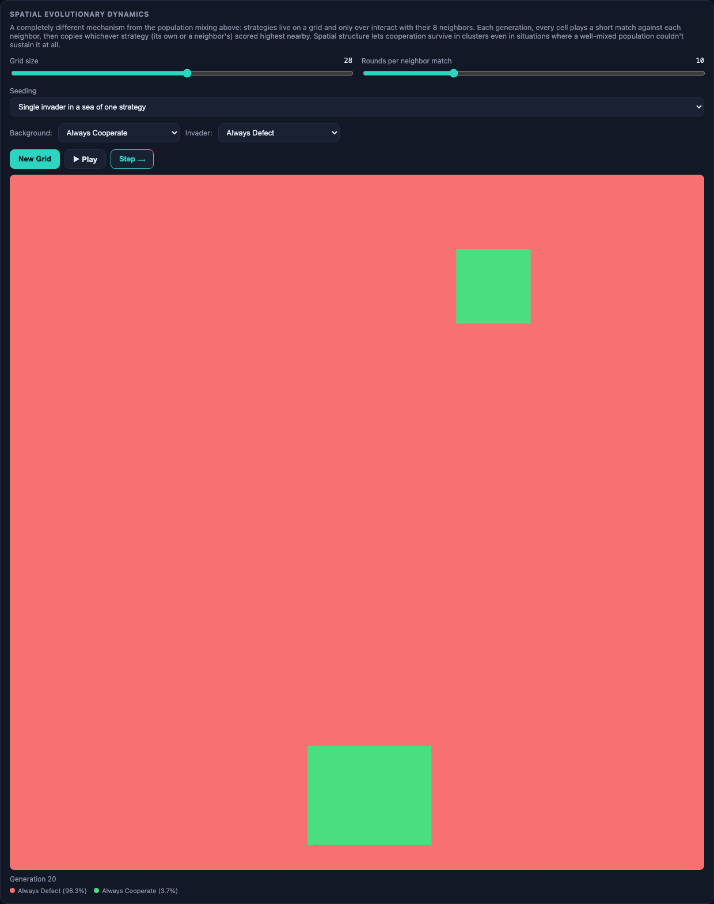
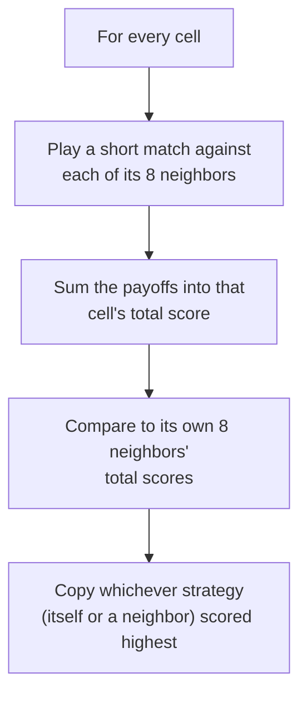

# Game Theory Lab

An interactive playground for the **Iterated Prisoner's Dilemma** — run Robert Axelrod's famous 1980s computer tournaments yourself, then watch an entire population of strategies evolve across generations under replicator dynamics.

No install, no build step, no dependencies. It's a single HTML file — open it and it runs.



## How the pieces fit together

The tournament and the evolutionary run are two different consumers of the same underlying match engine:



One evolutionary generation, in detail:



## Quick start

1. Download or clone this repo.
2. Open `index.html` in any modern browser.
3. The tournament runs automatically on load — scroll down to see the results.
4. Click **Run Evolution** to watch the population shift across generations.

## Step by step

### 1. Meet the strategies

Ten classic strategies are included, each a different answer to "what do I do given what's happened so far?":

| Strategy | Rule |
|---|---|
| Always Cooperate | Cooperates, no matter what |
| Always Defect | Defects, no matter what |
| Tit for Tat | Cooperates first, then mirrors the opponent's last move |
| Suspicious Tit for Tat | Defects first, then mirrors the opponent's last move |
| Grim Trigger | Cooperates until the opponent ever defects once — then defects forever |
| Tit for Two Tats | Only retaliates after the opponent defects *twice in a row* |
| Pavlov (Win-Stay, Lose-Shift) | Repeats its last move if the opponent cooperated, switches if they defected |
| Generous Tit for Tat | Like Tit for Tat, but forgives a defection about 10% of the time instead of always retaliating |
| Tester | Defects once to probe the opponent; switches to Tit for Tat if they retaliate, otherwise exploits them by defecting every other move |
| Random | Coin flip every round |

Uncheck any strategy to exclude it from the tournament and evolution below.

### 2. Choose a game

The four buttons under **Game** switch the payoff matrix between classic 2×2 games — same four values (T/R/P/S), different orderings, completely different dynamics:

- **Prisoner's Dilemma** (T > R > P > S, the default) — defecting wins individually, but mutual cooperation beats mutual defection.
- **Stag Hunt** (R > T > P > S) — mutual cooperation is the single best outcome for *both* players, but trusting your partner is risky.
- **Chicken** (T > R > S > P) — mutual defection is the *worst* outcome for both — better to back down than crash together.
- **Deadlock** (T > P > R > S) — defecting is just better, period. No real dilemma.

Expand **Payoff matrix (editable)** to set T/R/P/S by hand instead of using a preset.

### 3. Watch two strategies play head-to-head

Pick any two strategies from the dropdowns and click **▶ Play 20 rounds** to see their moves unfold one at a time — green `C` for cooperate, red `D` for defect — with the running score underneath. This is the fastest way to build intuition before looking at the full tournament: try Tit for Tat vs. Always Defect, or Grim Trigger vs. Suspicious Tit for Tat.

### 4. Play against a strategy yourself

Pick an opponent and click **Cooperate** or **Defect** yourself, one round at a time.



It uses whatever payoff matrix is currently active, so you can feel the difference directly — try a few rounds against Tit for Tat under Prisoner's Dilemma, then switch to Stag Hunt and notice how much more tempting defection stops being (or, under Chicken, how much more it costs to never back down).

### 5. Run the full tournament

Every strategy plays every other strategy (and itself) for however many rounds you set, and total scores are ranked. Click **Run Tournament** any time you change the strategy roster, rounds, noise, or payoff values.

Turn up **Noise** above 0% and rerun — moves now occasionally get flipped by "mistake." Watch what happens to **Grim Trigger** (a single accidental defection locks it into permanent retaliation) compared to more forgiving strategies like **Pavlov**, **Tit for Two Tats**, or **Generous Tit for Tat**.

The score matrix below the chart shows the average points-per-round every strategy earns against every other strategy — useful for understanding *why* the ranking came out the way it did.

### 6. Run evolution

This is where it gets interesting. Instead of one tournament, imagine a population where every checked strategy starts with an equal share, and each generation, strategies that scored above the population's average grow their share while below-average strategies shrink — standard replicator dynamics, using the payoff matrix from the tournament above.

Click **Run Evolution** and watch the stacked-area chart animate generation by generation.



With every strategy included, this consistently reproduces Axelrod's real historical finding: **Always Defect**, **Suspicious Tit for Tat**, and **Random** get squeezed out toward extinction, while the reciprocal, "nice-but-not-a-pushover" strategies — **Tit for Tat**, **Tit for Two Tats**, **Grim Trigger**, **Pavlov**, **Generous Tit for Tat** — grow to dominate the population.

Try removing strategies from the roster before rerunning evolution — e.g., take out all the "nice" reciprocal strategies and leave only Always Cooperate, Always Defect, and Random, and watch a very different (and much bleaker) population history play out. Or turn up the **Mutation rate** and watch even the worst-performing strategies get held just above zero instead of going fully extinct:



### 7. Watch defection spread across a grid

Scroll to **Spatial Evolutionary Dynamics** — a completely different mechanism from the population mixing above. Instead of every strategy being able to meet every other strategy in proportion to its population share, strategies live on a grid and only ever interact with their 8 immediate neighbors.

The default setup drops a single **Always Defect** cell into a sea of **Always Cooperate** and starts at Generation 0:



Click **Step** repeatedly, or **▶ Play** to animate it continuously. Each generation, every cell plays a short match against each of its 8 neighbors, then copies whichever strategy — its own or a neighbor's — scored highest in its immediate neighborhood. Watch what happens:



The lone defector's neighbors keep getting exploited by it, so from the perspective of anyone nearby, "be the defector" looks like the best available move — and it spreads outward, generation after generation, until it's taken over almost the whole grid. A single defector could never do this starting from a tiny share of the well-mixed population in the section above; spatial structure is what makes the difference.

Now try the reverse: switch **Background** to Always Defect and **Invader** to Tit for Tat. The lone Tit for Tat cell gets wiped out in a single generation — with no other nice strategies nearby to cooperate with, it has no way to outscore its exploitative neighbors. Real invasion of a defector-dominated grid generally needs a whole cluster of cooperators arriving together, not a lone individual — try switching **Seeding** back to "Random mix" with only cooperative strategies checked above and see how differently that plays out.

## How it works, in detail

### Strategies are stateless functions

Every strategy has the same shape: `fn(myHistory, opponentHistory) → 'C' | 'D'`, called once per round with both players' moves so far (not including the round about to be played). This is a deliberate constraint, not just a style choice — the *same* strategy object plays dozens of different opponents across one tournament, so it cannot keep private memory (like "which round am I retaliating on") between matches. Anything a strategy needs to know has to be derivable from the history arrays it's handed each call. Tit for Tat only needs the opponent's last move; Grim Trigger needs to know if `'D'` ever appears in the opponent's history at all; Tester needs to check what the opponent played at a specific index to know whether it "took the bait."

### A single match

```
for each round:
  a = strategyA.fn(movesA, movesB)
  b = strategyB.fn(movesB, movesA)
  # apply noise (flip a/b independently with some probability) if enabled
  scoreA += payoff(a, b);  scoreB += payoff(b, a)
  movesA.push(a);          movesB.push(b)
```

Moves are simultaneous — each strategy only ever sees rounds *before* the current one, never the opponent's move in the same round, which is what makes "Tester"'s opening probe meaningful (the opponent can't react to it until the following round).

### Payoff matrix and game presets

`payoff(mine, theirs)` is a lookup into four values: both cooperate → `R`; both defect → `P`; you defect against a cooperator → `T`; you cooperate against a defector → `S`. Every game preset in this app is the *same* lookup table with the four values reordered:

| Game | Ordering | What that ordering means |
|---|---|---|
| Prisoner's Dilemma | T > R > P > S | Defecting wins one-on-one, but mutual cooperation beats mutual defection |
| Stag Hunt | R > T > P > S | Mutual cooperation is the single best outcome — but risky to count on |
| Chicken | T > R > S > P | Mutual defection is the *worst* outcome for both |
| Deadlock | T > P > R > S | Defecting is simply better; there's no real tension |

### Tournament

A full round-robin — every strategy against every other strategy, including itself — for a fixed number of rounds per match. Rather than simulate `i vs j` and `j vs i` as two separate matches, one match produces both strategies' scores directly, which are recorded into an `avg payoff per round` matrix (`matrix[i][j]` = strategy i's average score per round against strategy j). That same matrix does double duty as both the tournament's score matrix display and the input to evolutionary dynamics.

### Evolutionary dynamics (replicator equation)

Given population shares `p₁...pₙ` (one per strategy) and the payoff matrix above, each generation:

```
fitness_i     = Σⱼ matrix[i][j] · p_j          (expected payoff against the current population mix)
avg_fitness   = Σᵢ fitness_i · p_i
p_i'          = p_i · (fitness_i / avg_fitness)   ← replicator update
p_i''         = (1 − mutation_rate) · p_i' + mutation_rate · (1/n)   ← optional mutation blend
```

Strategies scoring above the population average grow their share; below-average strategies shrink, and without mutation can shrink all the way to (floating-point) zero — permanent extinction, exactly as Axelrod's original simulations found for the uncooperative strategies. The mutation term is a standard mutation-selection balance: a constant trickle of every strategy regardless of current fitness, so nothing is ever driven to *exactly* zero and a strategy can in principle re-invade later if the population mix shifts back in its favor.

### Spatial dynamics

A toroidal (wraparound, so there are no artificial edges) grid where each cell holds one strategy. Every generation:



This is deliberately a *different* update rule from the population-mixing model — no explicit fitness-proportional reproduction, just deterministic "imitate the local best," matching the classic spatial-game literature (e.g. Nowak & May's 1992 "Evolutionary games and spatial chaos"). Every cell's score depends only on its immediate neighborhood, and every update is computed from the *previous* generation's grid all at once (not in place), so the order cells are processed in never matters.

The "single invader" seeding mode fills the grid with one strategy and drops a second strategy into the center cell. Whether that invader spreads or dies out in the very first generation depends entirely on whether its immediate neighbors' local score is high or low relative to what it's surrounded by — there's no momentum or protection beyond what the grid structure itself provides.

### Code layout

Everything lives in `index.html` with no external dependencies. Top-to-bottom: `Strategies → Payoff function → Match/tournament engine → Tournament chart & matrix rendering → Human-vs-strategy panel → Evolutionary dynamics → Spatial grid dynamics → Stacked-area & grid chart rendering → UI wiring`.

## Related projects

- **[cartpole-control](../cartpole-control)** — classical control (PID and LQR) balancing an inverted pendulum.
- **[cartpole-rl](../cartpole-rl)** — the same pendulum balanced by a reinforcement-learning agent instead.
